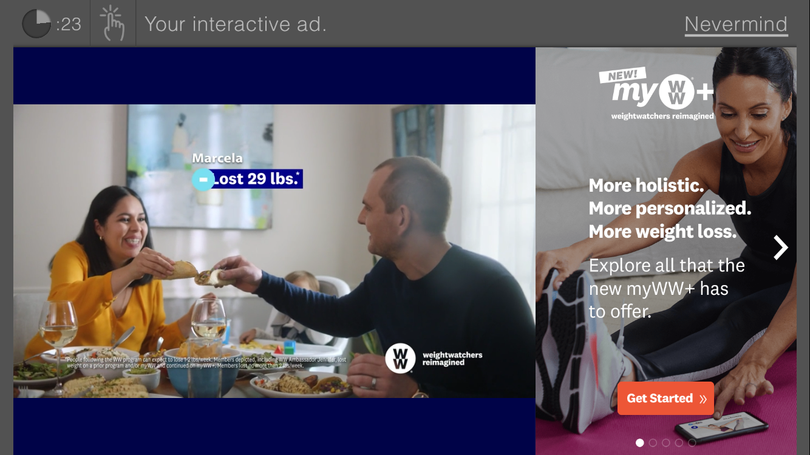

![true\[X\] logo](media/truex.png)

# TruexAdRenderer iOS Documentation

Version 3.2

## Contents

* [Overview](#overview)
* [Reference App](#reference-app)
* [Product Flows](#product-flows)
* [How to use TruexAdRenderer](#how-to-use-truexadrenderer)
    * [When to show true\[X\]](#when-to-show-truex)
    * [Handling Events from TruexAdRenderer](#handling-events-from-truexadrenderer)
        * [Terminal Events](#terminal-events)
    * [Handling Ad Elimination](#handling-ad-elimination)
* [TruexAdRenderer iOS API](#truexadrenderer-iOS-api)
    * [Adding `TruexAdRenderer` to Your Project](#adding-truexadrenderer-to-your-project)
    * [`TruexAdRenderer` Methods](#truexadrenderer-methods)
        * [`initWithUrl`](#initwithurl)
        * [`start`](#start)
        * [`stop`](#stop)
        * [`pause`](#pause)
        * [`resume`](#resume)
    * [`TruexAdRendererDelegate` Methods -- Main Flow](#truexadrendererdelegate-methods----main-flow)
        * [`onFetchAdComplete`](#onfetchadcomplete)
        * [`onAdStarted`](#onadstarted)
        * [`onAdCompleted`](#onadcompleted)
        * [`onAdError`](#onaderror)
        * [`onNoAdsAvailable`](#onnoadsavailable)
        * [`onAdFreePod`](#onadfreepod)
    * [`TruexAdRendererDelegate` Methods -- Informative](#truexadrendererdelegate-methods----informative)
        * [`onOptIn`](#onoptin)
        * [`onOptOut`](#onoptout)
        * [`onSkipCardShown`](#onskipcardshown)
        * [`onUserCancel`](#onusercancel)
        * [`onAdsAvailable`](#onadsavailable)

## Overview

In order to support interactive ads on iOS, true[X] has created a renderer library that can renderer true[X] ads, which interfaces with a hosting app, as well as its existing ad server and content delivery mechanism (e.g. SSAI).

With this library, the host player app can defer to the TruexAdRenderer when it is required to display a true[X] ad.

For simplicity, publisher implemented code will be referred to as "app code" while true[X] implemented code will be referred to as "renderer code".

true[X] will provide an Objective-C `TruexAdRenderer` library that can be loaded into the app. This library will offer a class, `TruexAdRenderer`, that will need to be instantiated, initialized and given certain commands (described below in [TruexAdRenderer Methods](#truexadrenderer-methods)) by the app code. It will also contain a singleton of shared constants, `TruexConstants`.

At this point, the renderer code will take on the responsibility of requesting ads from true[X] server, creating the UI for the true[X] choice card and interactive ad unit, as well as communicating events to the app code when action is required.

The app code will still need to parse out the SSAI ad response, detect when a true[X] ad is supposed to display, pause the stream, instantiate `TruexAdRenderer` and handle any events emitted by the renderer code. It will also need to call pause, resume and stop methods on the `TruexAdRenderer` when certain external events happen, like if the app is backgrounded or if the user has requested to exit the requested stream via back buttons.

It will also need to handle skipping ads in the current ad pod, if it is notified to do so.


## Reference App

**See**: https://github.com/socialvibe/truex-ios-reference-app

We've created a [sample integration](https://github.com/socialvibe/truex-ios-reference-app) which demonstrates a simple intergration with the `TruexAdRenderer` in a media app.


## Product Flows

There are two distinct product flows supported by `TruexAdRenderer`: Sponsored Stream (full-stream ad-replacement) and Sponsored Ad Break (mid-roll ad-replacement).

In a Sponsored Ad Break flow, once the user hits a mid-roll break with a true[X] tag flighted, they will be shown a "choice-card" offering them the choice between watching a normal set of video ads or a fully interactive true[X] ad:


_**Fig. A** example true[X] mid-roll choice card_

If the user opts for a normal ad break, or if the user does not make a selection before the countdown timer expires, the true[X] UI will close and playback of normal video ads can continue as usual.

If the user opts to interact with true[X], an interactive ad unit will be shown to the user:


_**Fig. B** example true[X] interactive ad unit_

The requirement for the user to "complete" this ad is for them to spend at least the allotted time on the unit and for at least one interaction (e.g. navigating anywhere through the ad).



_**Fig. C** example true[X] attention timer_

Once the user fulfills both requirements, a "I'm Done" button will appear in the bottom right, which the user can select to exit the true[X] ad. Having completed a true[X] ad, the user will be returned directly to content, skipping the remaining ads in the current ad pod.

The Sponsored Stream flow is quite similar. In this scenario, a user will be shown a choice-card in the pre-roll:


_**Fig. D** example true[X] pre-roll choice card (full-stream replacement)_

Similarly, if the user opts-in and completes the true[X] ad, they will be skipped over the remainder of the pre-roll ad break. However, every subsequent mid-roll break in the current stream will also be skipped over. In this case instead of the regular pod of video ads, the user will be shown a "hero card" (also known as a "skip card"):


_**Fig. E** example true[X] mid-roll skip card_

This messaging will be displayed to the user for several seconds, after which they will be returned directly to content.


## How to use TruexAdRenderer

### When to show true[X]

Upon receiving an ad schedule from your SSAI service, you should be able to detect whether or not true[X] is returned in any of the pods. true[X] ads should have `apiFramework` set to `VPAID` or `truex`.

SSAI vendors differ in the way they convey information back about ad schedules to clients. Certain vendors such as Verizon / Uplynk expose API’s which return details about the ad schedule in a JSON object. For other vendors, for instance Google DAI, the true[X] payload will be encapsulated as part of a companion payload on the returned VAST ad. Please work with your true[X] point of contact if you have difficulty identifying the right approach to detecting the true[X] placeholder, which will be the trigger point for the ad experience.

Once the player reaches a true[X] placeholder, it should pause, instantiate the `TruexAdRenderer` and immediately call [`init`](#initwithurl) followed by [`start`](#start).

Alternatively, you can instantiate and `init` the `TruexAdRenderer` in preparation for an upcoming placeholder. This will give the `TruexAdRenderer` more time to complete its initial ad request, and will help streamline true[X] load time and minimize wait time for your users. Once the player reaches a placeholder, it can then call `start` to notify the renderer that it can display the unit to the user.


### Handling Events from TruexAdRenderer

Once `start` has been called on the renderer, it will start to emit events, in the form of calling delegate methods (see [`TruexAdRendererDelegate` Methods -- Main Flow](#truexadrendererdelegate-methods----main-flow) and [`TruexAdRendererDelegate` Methods -- Informative](#truexadrendererdelegate-methods----informative))

One of the first events you will receive is [`onAdStarted`](#onadstarted). This notifies the app that the renderer has received an ad for the user and has started to show the unit to the user. The app does not need to do anything in response, however it can use this event to facilitate a timeout. If an `onAdStarted` event has not fired within a certain amount of time after calling `start`, the app can call `stop` on the renderer and proceed to normal video ads.

At this point, the app must listen for the renderer's [terminal events](#terminal-events), while paying special attention to the [`onAdFreePod`](#onadfreepod) event. A *terminal event* signifies that the renderer is done with its activities and the app may now resume playback of its stream. The `onAdFreePod` event signifies that the user has earned a credit with true[X] and all linear video ads remaining in the current pod should be skipped. If the `onAdFreePod` event did not fire before a terminal event is emitted, the app should resume playback without skipping any ads, so the user receives a normal video ad payload.

#### Terminal Events

The delegate methods representing *terminal events* are:
* [`onAdCompleted`](#onadcompleted): the user has exited the true[X] ad
* [`onNoAdsAvailable`](#onnoadsavailable): there were no true[X] ads available to the user
* [`onAdError`](#onaderror): the renderer encountered an unrecoverable error

It's important to note that the player should not immediately resume playback once receiving the `onAdFreePod` event -- rather, it should note that it was fired and continue to wait for a terminal event.


### Handling Ad Elimination

Skipping video ads is completely the responsibility of the app code. The SSAI API should provide enough information for the app to determine where the current pod end-point is, and the app, when appropriate, should fast-forward directly to this point when resuming playback.


## TruexAdRenderer iOS API

This is an outline of public `TruexAdRenderer` methods and `TruexAdRendererDelegate` methods (referred to as events).


### Adding `TruexAdRenderer` to Your Project

The easiest way to add `TruexAdRenderer` is via CocoaPods. The renderer will be maintained and distributed on Github.

1. Add the following Podspec repositories to your Podfile:
    ```ruby
    source 'https://github.com/socialvibe/cocoapod-specs.git'
    ```
1. Add the TruexAdRenderer pod to your target:
    ```ruby
    target 'MyApp' do
        pod 'TruexAdRenderer-iOS', '~> 3.2'
        # [...]
    end
    ```

### TruexAdRenderer Methods

#### `initWithUrl`

```objective-c
    - (_Nullable id)initWithUrl:(NSString* _Nullable)creativeUrl adParameters:(NSDictionary* _Nonnull)adParameters slotType:(NSString* _Nonnull)slotType;
```

This method should be called by the app code in order to initialize the `TruexAdRenderer`. The renderer will parse out the `creativeURL`, `adParameters` and `slotType` passed to it and make a request to the true[X] ad server to see what ads are available.

You may initialize `TruexAdRenderer` early (a few seconds before the next pod even starts) in order to give it extra time to make the ad request. The renderer will output an [`onFetchAdComplete`](#onfetchadcomplete) event at completion of this ad request. This event can be used to facilitate the implementation of a timeout or loading indicator, and when to make the call to `start`. Alternatively, you may pass in a completion block, which will be triggered when `TruexAdRenderer` is ready.

The parameters for this method call are:

* `creativeURL`: true[X] asset url returned by SSAI. In the example of Uplynk, this would correspond to `response.ads.breaks[0].ads[0].creative`
* `adParameters`: AdParameters as returned by SSAI. In the example of Uplynk, this would correspond to `response.ads.breaks[0].ads[0].adParameters`
* `slotType`: the type of the current ad pod, `PREROLL` or `MIDROLL`


#### `start`

```objective-c
    - (void)start:(UIView *)baseView;
```

This method should be called by the app code when the app is ready to display the true[X] unit to the user. This can be called anytime after the unit is initialized. 

The app should have as much extraneous UI hidden as possible, including player controls, status bars and soft buttons/keyboards.

After calling `start`, the app code should wait for a [terminal event](#terminal-events) before taking any more action, while keeping track of whether or not the [`onAdFreePod`](#onadfreepod) event has fired.

In a non-error flow, the renderer will first wait for the ad request triggered in `init` to finish if it has not already. It will then display the true[X] unit to the user in a new `View` presented on the `baseView` and then fire the [`onAdStarted`](#onadstarted) event. `onAdFreePod` and other events may fire after this point, depending on the user's choices, followed by one of the [terminal events](#terminal-events).

The parameters for this method call are:

* `baseView`: The `view` that `TruexAdRenderer` should present its `view` on.


#### `stop`

```objective-c
    - (void)stop;
```

The `stop` method is only called when the app needs the renderer to immediately stop and destroy all related resources. Examples include:
* the user backs out of the video stream to return to the normal app UI
* there was an unrelated error that requires immediate halt of the current ad unit
* the app code has reached a custom timeout waiting for either the [`onFetchAdComplete`](#onfetchadcomplete) or [`onAdStarted`](#onadstarted) events

The `TruexAdRenderer` instance should not be used again after calling `stop` -- please remove all references to it afterwards.

In contrast to `pause`, there is no way to resume the ad after `stop` is called.


#### `pause`

```objective-c
    - (void)pause;
```

`pause` is required whenever the app needs to pause the true[X] unit (including all video, audio, and timers).


#### `resume`

```objective-c
    - (void)resume;
```

`resume` should be called when the app is ready for a previously paused true[X] unit to resume.


### `TruexAdRendererDelegate` Methods -- Main Flow

The following `TruexAdRendererDelegate` methods signal the main flow of the `TruexAdRenderer` and may require action by the host app. The `TruexAdRendererDelegate` protocol can be found in `TruexShared.h`.


#### `onFetchAdComplete`

```objective-c
    - (void)onFetchAdComplete;
```

This method is marked as **`@optional`** in the `TruexAdRendererDelegate` protocol.

This method is called in response to the `init` method when the true[X] ad request has successfully completed and the ad is ready to be presented. The host app may use this event to facilitate a loading screen for pre-rolls, or to facilitate an ad request timeout for mid-rolls.

For example: `init` is called for the pre-roll slot, and the app code shows a loading indicator while waiting for `onFetchAdComplete`. Then, either the event is received (and the app can call `start`) or a specific timeout is reached (and the app can call `stop` and resume playback of normal video ads).

Another example: `init` is called well before a mid-roll slot to give the renderer a chance to preload its ad. If `onFetchAdComplete` is received before the mid-roll slot is encountered, then the app can call `start` to immediately present the true[X] ad. If not, the app can wait for a specific timeout (if not already reached, in case the user has seeked to activate the mid-roll) before calling `stop` on the renderer and resuming playback with normal video ads.


#### `onAdStarted`

```objective-c
    - (void)onAdStarted:(NSString*)campaignName;
```

This event will fire in response to the `start` method when the true[X] UI is ready and has been added to the view hierarchy.

The parameters for this method call are:

* `campaignName`: The name of the ad campaign available to the user (e.g. "*Storebought Coffee - Sample Video Ad #1 - Q1 2017*")


#### `onAdCompleted`

```objective-c
    - (void)onAdCompleted:(NSInteger)timeSpent;
```

This is a [terminal event](#terminal-events). This event will fire when the true[X] unit is finished with its activities -- at this point, the app should resume playback and remove all references to the `TruexAdRenderer` instance.

Here are some examples where `onAdCompleted` will fire:

* The user opts for normal video ads (not true[X])
* The choice card countdown runs out
* The user completes the true[X] ad unit
* After a "skip card" has been shown to a user for its duration

The parameters for this method call are:

* `timeSpent`: The amount of time (in seconds) the user spent on the true[X] unit


#### `onAdError`

```objective-c
    - (void)onAdError:(NSString*)errorMessage;
```

This is a [terminal event](#terminal-events). This event will fire when the true[X] unit has encountered an unrecoverable error. The app code should handle this the same way as an `onAdCompleted` event -- resume playback and remove all references to the `TruexAdRenderer` instance.


#### `onNoAdsAvailable`

```objective-c
    - (void)onNoAdsAvailable;
```

This is a [terminal event](#terminal-events). This event will fire when the true[X] unit has determined it has no ads available to show the current user. The app code should handle this the same way as an `onAdCompleted` event -- resume playback and remove all references to the `TruexAdRenderer` instance.


#### `onAdFreePod`

```objective-c
    - (void)onAdFreePod;
```

This event will fire when the user has earned a credit with true[X]. The app code should notate that this event has fired, but should not take any further action. Upon receiving a [terminal event](#terminal-events), if `onAdFreePod` was fired, the app should skip all remaining ads in the current slot. If it was not fired, the app should resume playback without skipping any ads, so the user receives a normal video ad payload.


#### `onPopupWebsite`

```objective-c
    - (void)onPopupWebsite:(NSString *)url;
```

This event will fire when the user has clicked an external link in the true[X] true[X] interactive ad unit. The app code should open this webpage either in a WebView, SFSafariViewController, or deeplink to a Web Browser. Note, app code should pause and resume the `TruexAdRenderer` accordingly.


### `TruexAdRendererDelegate` Methods -- Informative

All following delegate methods are marked as **`@optional`** in the `TruexAdRendererDelegate` protocol, and are used mostly for tracking purposes -- no action is generally required.


#### `onOptIn`

```objective-c
    - (void)onOptIn:(NSString*)campaignName adId:(NSInteger)adId;
```

This method is marked as **`@optional`** in the `TruexAdRendererDelegate` protocol.

This event will fire if the user selects to interact with the true[X] interactive ad.

Note that this event may be fired multiple times if a user opts in to the true[X] interactive ad and subsequently backs out.

The parameters for this event are:

* `campaignName`: The name of the ad campaign.
* `adID`: The ad ID.


#### `onOptOut`

```objective-c
    - (void)onOptOut:(BOOL)userInitiated;
```

This method is marked as **`@optional`** in the `TruexAdRendererDelegate` protocol.

This event will fire if the user opts for a normal video ad experience.

The parameters for this event are:

* `userInitiated`: This will be set to `true` if this was actively selected by the user, `false` if the user simply allowed the choice card countdown to expire.


#### `onSkipCardShown`

```objective-c
    - (void)onSkipCardShown;
```

This method is marked as **`@optional`** in the `TruexAdRendererDelegate` protocol.

This event will fire anytime a "skip card" is shown to a user as a result of completing a true[X] Sponsored Stream interactive ad in an earlier pre-roll.


#### `onUserCancel`

```objective-c
    - (void)onUserCancel;
```

This method is marked as **`@optional`** in the `TruexAdRendererDelegate` protocol.

This event will fire when a user backs out of the true[X] interactive ad unit after having opted in. This would be achieved by tapping the "Yes" link to the "Are you sure you want to go back and choose a different ad experience" prompt inside the true[X] interactive ad. The user will be subsequently taken back to the Choice Card (with the countdown timer reset to full).

Note that after a `onUserCancel`, the user can opt-in and engage with an interactive ad again, so more `onOptIn` or `onOptOut` events may then be fired.


#### `onAdsAvailable`

```objective-c
    - (void)onAdsAvailable;
```

This method is marked as **`@optional`** in the `TruexAdRendererDelegate` protocol.

This event will fire after the initial init call when the true[X] unit has determined it has ad available to show the current user. No action needed for this event.